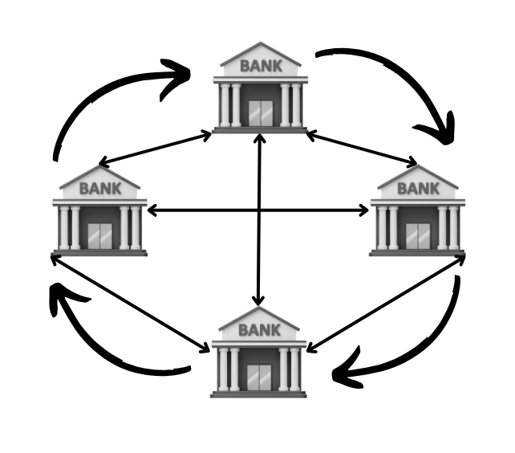
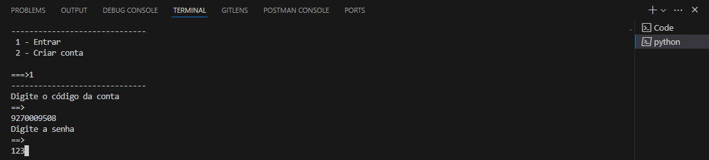

# PBL2-Redes - Sistema de Bancos Distribuídos

# Introdução

Nos últimos anos, a adoção de movimentações financeiras exclusivamente por dispositivos móveis cresceu significativamente, impulsionada pela criação do Pix e pelo forte investimento dos bancos em aplicativos. Tal movimento transformou a maneira como os brasileiros realizam pagamentos, permitindo a inclusão financeira de milhões de pessoas. Inspirados pelo sucesso do Pix, o governo de um país sem banco central deseja desenvolver um sistema semelhante que permita a criação de contas bancárias, facilitando pagamentos, depósitos e transferências entre diferentes bancos sem a necessidade de um controle centralizado. Para isso, foi formado um consórcio bancário para desenvolver uma solução robusta e segura utilizando Python. Esta solução, através de um conjunto de estratégias, garante que as transações sejam atômicas e previne problemas como o duplo gasto, oferecendo uma infraestrutura confiável e eficiente para os clientes de todos os bancos participantes.

# Sumário
- <A href = "#Intr">Introdução</A> 
- <A href = "#Api">Api</A> 
- <A href = "#Interface">Interface Cli</A> 
- <A href = "#Arq">Arquitetura da solução</A> 
- <A href = "#Rest">Interface da Aplicação (REST)</A> 
- <A href = "#Pro">Problemáticas e Soluções</A> 
  - <A href = "#Trat">Tratamento de Conexões Simultâneas</A> 
    - <A href = "#Rede">Rede em Anel (Token Ring)</A> 
    - <A href = "#Lock">Lock </A> 
    - <A href = "#2pc">2PC e 2PL</A> 
- <A href = "#clie">Utilizando a Interface</A> 
- <A href = "#Teste">Testes</A> 
- <A href = "#Exec">Como Executar</A> 
- <A href = "#Conc">Conclusão</A> 

# Api

A API atua como servidor para um banco específico, permitindo aos usuários acessar diversas funcionalidades, tais como: criação de contas, realização de transferências, depósitos, saques, entre outras. Toda a comunicação ocorre por meio de uma API REST, implementada com Flask, uma biblioteca versátil da linguagem Python.

## Arquivo Principal (new_api.py)

Este arquivo contém as rotas responsáveis pela gerenciamento de transações via token e pela realização de transações bancárias. Ele implementa métodos HTTP POST, GET, PUT e DELETE para operações específicas. Abaixo estão detalhadas as funcionalidades de cada rota e função desse arquivo.

 `Observação:` Vale ressaltar que a dinâmica de utilização do token para o gerenciamento de transações será abordada na subseção "Rede em Anel" da seção "Problemáticas e Soluções".
 
### Rotas

  - ***/id:*** Rota GET responsável por fornecer um ID válido para uso em um pacote de transações. Retorna o ID e o código 201 quando bem-sucedido.

  - ***/status:*** Rota GET responsável por verificar o status de um pacote de transações enviado para execução no banco, utilizando o ID da transação recebido no JSON, retorna o código 201 se o pacote foi executado com sucesso e 401 caso contrário.

  - ***/receive_token:*** Rota POST responsável por receber o token de outro banco do consórcio. Retorna o código 200 quando o token é recebido com uma sequência válida. A sequência estará presente no JSON.

  - ***/login:*** Rota POST responsável por verificar o usuário e senha enviados pelo JSON. Retorna o código 201 quando as credenciais correspondem aos dados do banco; caso contrário, retorna 401.

  - ***/users:*** Rota GET responsável por pegar os dados de todos os usuários do banco. Retorna 201 quando executado adequandamente. Vale informar que por segurança nenhum retorno da API retorna dados de senha.

  - ***/users/user_id:*** Rota GET responsável por pegar os dados de um usuário específico, através do user_id. Retorna 201 quando executado adequandamente e 401 caso contrário.

  - ***/users:*** Rota POST responsável por criar um usuário no banco. Retorna 201 quando executado adequandamente.

  - ***/users/user_id/accounts:*** Rota POST responsável por postar uma nova conta a um usuário existente, através do parametro user_id. Retorna 201 quando executado adequandamente e 401 caso contrário.

  - ***/users/user_id/accounts:*** Rota GET responsável por pegar todas as contas de um usuário específico, através do user_id. Retorna 201 quando executado adequandamente e 401 caso contrário.

  - ***/users/user_id/accounts/account_id:*** Rota GET responsável por pegar uma conta específico, através do user_id e account_id. Retorna 201 quando executado adequandamente e 401 caso contário.

  - ***/users/user_id:*** Rota DELETE responsável por deletar um usuário específico, através do user_id. Retorna 201 quando executado adequandamente.

  - ***/users/user_id:*** Rota PUT responsável por atualizar um usuário específico, através do user_id. Seu retorno é 201 para atualizado com sucesso e 401 caso contrário.

  - ***/users/user_id/accounts/account_id/deposit:*** Rota responsável por realizar um deposito em uma conta especificada pelo user_id e account_id. O JSON só indica o valor a ser depositado. Como as outras rotas, o retorno 201 representa que a operação foi bem sucedida e 401 representa o oposto.

  - ***/users/user_id/accounts/account_id/take:*** Rota responsável por realizar um saque em uma conta especificada pelo user_id e account_id. O JSON indica apenas o valor do saque. Assim como nas outras rotas, retorna o código 201 quando executado adequadamente e 401 caso contrário.

  - ***/sender:*** Rota responsável por adicionar o valor transferido à conta de destino, utilizando o ID e o valor recebidos do JSON. Ademais, retorna o código 201 se a operação for bem-sucedida e 401 caso contrário.

  - ***/abort:*** Rota responsável por reverter uma transação de um pacote. Ela utiliza do ID e valor recebido para realizar essa operação e retorna o código 201 se a reversão for bem-sucedida e 401 caso contrário.

  - ***/recipient:*** Rota responsável por receber um valor e um ID, e realizar o débito desse valor no saldo da conta associada a esse ID. Vale ressaltar que seu retorno é 201 quando executada corretamente e 401 caso contrário.

  - ***/transfers:*** Rota responsável por receber pacotes de transações da interface CLI a qualquer momento e armazená-los na lista de transferências. Se executada adequadamente, retorna o código 201; caso contrário, retorna 401.
     
### Funções

  - ***pass_token():*** Esta função opera em uma thread no servidor e tem como propósito transferir o token para outro banco dentro do consórcio. A transferência ocorre somente quando todas as condições necessárias para o repasse do token são satisfeitas.

  - ***receive_token():*** Esta função é responsável por executar uma sequência de operações imediatamente após receber o token pela rota designada. Primeiro, ela tenta realizar a operação. Em seguida, ela atualiza o valor de uma variável global, liberando uma thread encarregada de passar o token para outro banco do consórcio.

  - ***check_token():*** Esta função verifica o tempo que o banco está sem o token. Ademais, ela opera em uma thread separada para não interferir nas outras funções do servidor do banco e caso o banco fique sem o token por um período específico, a função interpreta que o consórcio perdeu o token e regenera um novo.

  - ***find_account(user, account_id):*** Esta função é responsável por buscar uma conta específica utilizando os parâmetros user e account_id. Retorna None caso a conta não exista no banco.

  - ***find_user(user_id):*** Função responsável por buscar um usuário específico na lista de usuários, utilizando o parâmetro user_id. Retorna None caso o usuário não seja encontrado.
  
  - ***abort_transactions(transactions):*** Esta função desempenha um papel crucial na garantia da atomicidade, sendo responsável por reverter as transações do pacote em caso de problemas durante sua execução. A rota "/abort" é utilizada para desfazer as transações que foram realizadas com sucesso anteriormente, e que estavam no mesmo pacote da transação que falhou.
    
  - ***transfer(transations):*** Tal função se caracteriza por executar todas as transações recebidas de maneira segura, garantindo a atomicidade dentro do pacote de transações passado como parâmetro desta função. Ademais, ao finalizar retorna True quando o pacote é executado com sucesso e False caso contrário.
 
  - ***init_server_flask():*** Esta função é responsável por inicializar a aplicação Flask.

  - ***main():*** Por último, esta função, como o próprio nome indica, é responsável pela ordem de execução das outras funções e rotas. Neste arquivo, ela é concisa, focando na inicialização das threads para passagem de token, verificação de token e da API do banco.

   `Observação:` Vale ressaltar que boa parte dessas funções possuem um bloco try-catch, visto que realizam operações delicadas. Mais detalhes podem ser encontrados na documentação do código.
    

# Interface Cli

A interface CLI permite que o usuário acesse as funcionalidades do banco. Para isso, o arquivo da interface utiliza requisições HTTP para interagir com o servidor do banco.

## Arquivo Principal (new_user.py)

A seguir, uma breve descrição de cada função presente no arquivo 'new_user.py', que representa nossa interface CLI.

  - ***login(users):*** Esta função é responsável por realizar o login ou criar uma nova conta. No processo de login, utiliza a lista de usuários fornecida como parâmetro. O retorno são os dados do usuário logado.

  - ***createAccount(id, name, age, password, tipo, pix):*** Esta função é responsável por realizar a criação de uma conta dentro do banco. Os parâmetros da função representam os dados necessários para essa criação de conta.

  - ***verificarLogin(id, password):*** Esta função é responsável por verificar o login de um usuário em sua conta bancária, através de uma rota POST,  utilizando os parâmetros id e password.

  - ***addBank(id, saldo, password):*** Esta função tem como objetivo adicionar uma nova conta bancária a um usuário existente dentro do banco através de uma requisição POST. Os parâmetros incluem os dados dessa nova conta.

  - ***getUsers():*** Esta função é responsável por obter os dados de todos os usuário do banco. O retorno da função é a lista de usuários.

  - ***getUser(id):*** Esta função é responsável por obter os dados de um usuário do banco através de uma requisição GET. O parâmetro id é utilizado para buscar esse usuário no servidor do banco e o retorno é um dicionário com os dados do usuário.

  - ***logged(user):*** Esta função tem como propósito oferecer uma série de opções quando o usuário já estiver logado em sua conta no banco. As opções incluem: realizar transação, depósito, saque, sair, entre outras. O parâmetro user armazena os dados de conta do usuário.

  - ***verStatus(id):*** Esta função tem como objetivo realizar um GET no servidor do banco para verificar o status do último pacote de transações enviado pela interface. O parâmetro id representa o id do pacote de transações para fazer a verificação no banco.

  - ***getTransId():*** Esta função tem como objetivo realizar um GET de um ID válido no servidor do banco para adicionar a uma transação que está sendo criada. O retorno da função será esse ID.

  - ***requestSaque(valor, id, conta):*** Esta função é responsável por realizar o POST de um saque em uma conta especificada pelos parâmetros da função. Os parâmetros incluem o valor a ser sacado, o ID do usuário e a chave PIX da conta.

  - ***requestDeposito(valor, id, conta):*** Esta função é responsável por realizar o POST de um depósito em uma conta especificada pelos parâmetros da função. Os parâmetros incluem o valor a ser depositado, o ID do usuário e a chave PIX da conta.

  - ***requestTransferencia(dic, id_origem):*** Esta função tem como propósito realizar o POST de um pacote de transações no servidor do banco por meio de rotas HTTP. A rota utilizada é "/transfers". Os parâmetros da função representam o dicionário que será enviado e o id_origem, que identifica a conta que realizará o pacote de transferências.

  - ***limpar_terminal():*** Esta função tem como responsabilidade limpar o terminal. Para isso, ela verifica o sistema operacional para determinar qual função utilizar. Isto pois para limpar o terminal no "Windows" é diferente de limpar no "Linux".

  - ***main():*** Esta função é responsável por definir as regras de negócio do programa, estabelecendo a ordem de execução das funções e procedimentos presentes no sistema.

   `Observação:` Vale ressaltar que boa parte dessas funções possuem um bloco try-catch, visto que realizam operações delicadas. Mais detalhes podem ser encontrados na documentação do código.

# Arquitetura da solução

Para abordar a arquitetura utilizada na interação entre bancos e contas, onde as transações são realizadas de maneira descentralizada, é instrutivo primeiro explicar como essas transações são normalmente efetuadas de modo centralizado, com o auxílio do banco central. Em seguida, podemos explorar a arquitetura descentralizada adotada neste sistema, assim como as soluções implementadas para mitigar os problemas inerentes aos sistemas descentralizados.

### Sistema de Bancos Centralizado

Um sistema bancário centralizado envolve o banco central desempenhando um papel crucial na intermediação e controle das transações entre instituições financeiras. Nesse modelo, todas as transações, como transferências de fundos entre bancos e liquidação de pagamentos, são processadas e monitoradas pelo banco central. Isso implica que todas as partes envolvidas dependem diretamente das operações e diretrizes estabelecidas pelo banco central para as suas atividades financeiras. Esse sistema centralizado proporciona um controle rigoroso e uma supervisão eficiente das operações financeiras, mas também pode apresentar desafios como possíveis gargalos de comunicação e vulnerabilidades à falhas sistêmicas.

  
- ***Banco -> Banco e Banco -> Banco Central:*** A comunicação entre bancos para o envio de diversas transações pode ser realizada utilizando API REST, semelhante a qualquer outro tipo de API. As regras e protocolos de comunicação são determinados pelo banco intermediador da transação, que, neste caso, é o banco central.

  `Observação:` Qualquer falha no Banco Central afeta todos os bancos envolvidos, o que também se aplica a falhas de segurança.
   
  `Definição:` Uma API REST (Representational State Transfer) é uma arquitetura de comunicação que utiliza os princípios do protocolo HTTP para permitir a comunicação entre sistemas distribuídos.

Abaixo você pode ver como se da a interação entre os bancos e o banco cantral, para isso observe a <em>Figura 1.</em> 

 

   
   
     <em>Figura 1. Sistema de Bancos Centralizado.</em>  
   
   

Analisando a imagem, observa-se que toda a comunicação depende do agente central. Em outras palavras, qualquer interação entre os bancos necessariamente envolve o banco central. No entanto, um ponto relevante ao utilizar um sistema bancário centralizado é que ele tende a apresentar menos problemas relacionados à concorrência, e quando surgem problemas, as soluções são geralmente mais simples do que em sistemas distribuídos.

### Sistema de Bancos Descentralizados (Utilizado nesta Aplicação)

 Em um sistema de bancos distribuídos, a arquitetura permite que múltiplos bancos operem de forma interligada e colaborativa, sem depender exclusivamente de um ponto central de controle. Cada banco possui autonomia para processar transações localmente e se comunicar diretamente com outros bancos dentro do consórcio. Essa abordagem promove maior resiliência e escalabilidade ao sistema, uma vez que falhas em um banco não comprometem necessariamente todo o sistema. Além disso, a distribuição de recursos e responsabilidades entre os bancos pode otimizar a eficiência operacional e aumentar a segurança, permitindo o processamento paralelo e redundante das transações, reduzindo a vulnerabilidade a falhas em pontos únicos. 

`Observação:` Ademais, note que sistemas distribuídos possuem vários desafios na sua implementação. Gerenciar a consistência dos dados entre diferentes bancos, garantir a sincronização adequada das transações, lidar com a latência das comunicações entre os bancos e garantir a segurança de ponta a ponta são alguns dos desafios críticos enfrentados. Além disso, a complexidade aumenta com a necessidade de implementar algoritmos distribuídos para coordenação e consenso entre os sistemas, visando evitar problemas como inconsistências de dados e conflitos de transações. Tais problemáticas sobre a implementação desse sistema serão abordadas na seção "Problemáticas e Soluções".

 

   
   
     <em>Figura 2. Sistema de Bancos Descentralizados.</em>  
   
   

Observe que a imagem ilustra que um banco pode se conectar com todos os outros bancos presentes no consórcio. Isso ocorre porque, em caso de falha no sistema de um desses bancos, ele pode tentar se comunicar com outro banco disponível. Dessa forma, ao contrário dos sistemas centralizados, a dependência é reduzida, pois para que todo o sistema pare, todos os bancos teriam que estar fora do ar simultaneamente.

# Interface da Aplicação (REST)

Em relação a API foram criadas diversas rotas, as quais utilizaram verbos/métodos como POST, PUT, GET e DELETE.

- ***POST:*** Em relação aos métodos POST, temos dez rotas que à utilizam. Podemos ver a estrutura para construção dessas rotas na Figura 3, 4, 5, 6, 7 e 8.
  
  

   
   
     <em>Figura 3. Métodos POST.</em>  
   
   

   

   
   
     <em>Figura 4. Métodos POST.</em>  
   
   

   

   
   
     <em>Figura 5. Métodos POST.</em>  
   
   

   

   
   
     <em>Figura 6. Métodos POST.</em>  
   
   

   

   
   
     <em>Figura 7. Método POST.</em>  
   
   

   

   
   
     <em>Figura 8. Método POST.</em>  
   
   

- ***PUT:*** Só há uma rota que utiliza este método, tal rota se chama "http://{id do banco junto com a porta}/users/{id do usuário}". Vale lembrar que essa método realiza atualizações na minha API. Mais detalhes na Figura 9.

   
   
     <em>Figura 9. Método PUT.</em>  
   
   

- ***GET:*** Já em relação aos métodos GET utilizados, temos 6, os quais são dois para transações e 4 para usuários e contas. As referêntes a transação são as rotas "http://{id do banco junto com a porta}/id" e "http://{id do banco junto com a porta}/status". Já as outras rotas são referêntes as contas e usuários do banco, sendo elas: "http://{id do banco junto com a porta}/users", "http://{id do banco junto com a porta}/users/{id do usuário}", "http://{id do banco junto com a porta}/users/{id do usuário}/accounts" e "http://{id do banco junto com a porta}/users/{id do usuário}/accounts/{id da conta}" , respectivamente. Podemos ver mais detalhes nas Figuras 10, 11 e 12.

   
   
     <em>Figura 10. Métodos GET.</em>  
   
   

   

   
   
     <em>Figura 11. Métodos GET.</em>  
   
   

   

   
   
     <em>Figura 12. Métodos GET.</em>  
   
   

- ***DELETE:*** Por fim os métodos DELETE, temos somente 1, assim como os método PUT, , cuja rota é "http://{id do banco junto com a porta}/users/{id do usuário}". Para mais detalhes observe a Figura 13.

   
   
     <em>Figura 13. Métodos DELETE.</em>  
   
   

# Problemáticas e Soluções 

# Tratamento de Conexões Simultâneas

Sobre o tratamento de múltiplas conexões, utilizamos threads tanto para receber dados, enviar dados e aceitar entrada de dados do terminal, tudo de maneira paralela. Em relação aos problemas de conectividade, não foram identificados, já que esses problemas ocorrem quando há uma extrema quantidade de dispositivos e clientes, e pela quantidade de aparelhos conectados na aplicação não houve esse tipo de problema. Contudo, vale falar sobre os possíveis problemas ao utilizarmos threads, sendo eles: Condições de corrida, Deadlocks, Starvation, Overhead e Dificuldade de depuração.

`Definições:` 

- **Condições de corrida:** Quando várias threads tentam acessar e modificar os mesmos dados ao mesmo tempo, podem ocorrer resultados inconsistentes.

- **Deadlocks:** Ocorre quando duas ou mais threads ficam aguardando indefinidamente por recursos que a outra possui. Isso pode paralisar o sistema.

- **Starvation:** Algumas threads podem ficar impedidas de fazer progresso devido a outras threads monopolizarem recursos necessários.

- **Overhead:** O uso excessivo de threads pode levar a um alto consumo de recursos do sistema, como memória e CPU, devido ao contexto de comutação e à sincronização necessária entre as threads.

- **Dificuldades de depuração:** Problemas de concorrência podem ser difíceis de reproduzir e depurar, especialmente em sistemas complexos com muitas threads em execução simultânea.

`Observação:` Pelo uso que foi feito dessa aplicação não foi preciso se preocupar com essas questões, contudo para a ampliação de dispositivos e clientes seria de suma importância relevarmos todos os possivéis problemas.  

# Rede em Anel (Token Ring)

# Lock

# 2PC E 2PL
   

# Utilizando a Interface

Observe que abaixo seguem algumas Figuras que mostram como a interface CLI se comporta.

   
   
     <em>Figura 14. Interface Cli para Criação de Conta ou Login.</em>  
   
   

  

   
   
     <em>Figura 15. Criação de Conta.</em>  
   
   

   
   
     <em>Figura 16. Login em Conta.</em>  
   
   

   

   
   
     <em>Figura 17. Interface Cli Quando Logado.</em>  
   
   

   

   
   
     <em>Figura 18. Tentativa de Depósito.</em>  
   
   

   

   
   
     <em>Figura 19. Visualização do Saldo após Depósito.</em>  
   
   

   

   
   
     <em>Figura 20. Tentativa de Saque.</em>  
   
   

   

   
   
     <em>Figura 21. Visualização do Saldo após saque e Tentativa de Criação de um Pacote de Transações.</em>  
   
   

   
`Observação:` Para essa seção não se estender muito, na parte da interface referente ao pacote de transações, quando digitar 1, você irá adicionar outra transação ao pacote; e, se digitar 2, o pacote de transações será enviado para ser executado pelo servidor do banco.

# Testes

A seguir, serão apresentados uma série de testes realizados utilizando as rotas, utilizando ferramentas como Postman e Thunder Client. Além de visualizar o terminal do servidor.

As Figuras 22 e 23 ilustram a correta passagem do token. Note que a sequência que chega a um servidor é sempre diferente daquela que chega a outro servidor. Esse teste foi realizado para evitar a duplicação do token na rede.
  

   
   
     <em>Figura 22. Visualização da Passagem de Token pelos Bancos do Consórcio.</em>  
   
   

  

   
   
     <em>Figura 23. Visualização da Passagem de Token pelos Bancos do Consórcio.</em>  
   
   

A Figura 24 ilustra a reeleição do token na rede quando ele se perde. Considera-se o token perdido quando um servidor fica sem recebê-lo por um determinado período de tempo.

   
   
     <em>Figura 24. Visualização da Reeleição do Token na rede quando ele se perde.</em>  
   
   

As Figuras 25 e 26 ilustram os dados das contas antes da execução dos testes mostrados nas Figuras 27 e 28, que foram realizados simultaneamente utilizando o Flows do Postman, conforme exibido na Figura 29. Esse teste foi realizado para observar se um dado está sendo sobreposto pelo outro. Os resultados podem ser vistos nas Figuras 30 e 31. Ao analisar sa gravuras irá perceber que isso não ocorre.

  

   
   
     <em>Figura 25.</em>  
   
   

   

   
   
     <em>Figura 26.</em>  
   
   

   
   
     <em>Figura 27.</em>  
   
   

   
   
     <em>Figura 28.</em>  
   
   

   

   
   
     <em>Figura 29.</em>  
   
   

   

   
   
     <em>Figura 30.</em>  
   
   

   

   
   
     <em>Figura 31.</em>  
   
   

Foi realizado outro teste utilizando os dados iniciais ilustrados nas Figuras 30 e 31. Desta vez, os dados mostrados na Figura 27 foram enviados duas vezes para verificar se a operação seria realizada mesmo sem saldo. Os resultados podem ser vistos nas Figuras 32 e 33. Ao observar o resultado perceberá que não houve duplo abate, já que isso iria deixar a conta com saldo negativo.

   

   
   
     <em>Figura 32.</em>  
   
   

   

   
   
     <em>Figura 33.</em>  
   
   

As Figuras 32 e 33 representam os dados iniciais para o teste de um pacote de transferências que será executado pelo servidor. O pacote pode ser visualizado na Figura 34. Neste caso, a primeira transação será bem-sucedida; no entanto, devido à impossibilidade de execução da segunda transação do pacote, o pacote inteiro será abortado, resultando na reversão da primeira transação. Os resultados podem ser vistos novamente nas Figuras 32 e 33.

   

   
   
     <em>Figura 34.</em>  
   
   

Por último, foi realizado um teste utilizando novamente os dados ilustrados nas Figuras 32 e 33. O pacote a ser enviado está ilustrado na Figura 35. O objetivo deste teste é verificar se o pacote será executado corretamente, uma vez que todas as contas possuem fundos para realizar as operações. Os resultados desse teste podem ser visualizados na Figura 36 e 33.

   

   
   
     <em>Figura 35.</em>  
   
   

   

   
   
     <em>Figura 36.</em>  
   
   

# Como Executar

## Etapas:

### 1. Configuração do Ambiente:

   - **Requisitos do Sistema:** Será preciso ter ao menos o Docker instalado na máquina para que seja possível criar a imagem e executá-la.

`Observação:` Caso não possua o Docker instalado você poderá executar os arquivos new_api.py e new_user.py via terminal. 
     
### 2. Obtenção do Código Fonte:

   - **Clonagem do Repositório:** Você pode utilizar o seguinte comando no terminal para adquirir a aplicação:                                          

           git clone https://github.com/Emanuel-Antonio/PBL2-Redes.git.
     
   - **Download do Código Fonte:** Caso não tenha o Git na máquina, você pode fazer o download desse repositório manualmente. Vá até o canto superior, selecione "Code" e depois "Download ZIP", e então extraia o arquivo ZIP na sua máquina.

### 3. Configuração da Aplicação:

   - **Arquivos de Configuração:** Abra as pastas "Bank" e "Client" e altere nos arquivos "new_api.py" e "new_user.py" o endereço IP para o endereço da máquina onde o banco está rodando, banco é representado pelo arquivo new_api.py.
     
`Observação:` Execute essa etapa somente se não informar o IP ao rodar a imagem do docker.  

### 4. Execução da Aplicação:

   - **Com Docker:**
     
     1. Execute o seguinte comando no terminal dentro das pastas Bank e Client: "docker build -t nome_do_arquivo .", para gerar as imagens, repita duas vezes.
        
     2. Agora execute as imagens usando o comando "docker run --network='host' -it -e IP=ipBank nome_da_imagem" para executar as imagens do new_api.py e new_user.py.

`Observação:` Se não quiser rodar através do docker execute pelo terminal usando o comando "python arquivo.py", para os dois arquivos antes mencionados.

# Conclusão

Por fim, destaco que este projeto atende a todas as exigências previamente propostas e desempenha um papel significativo no aprimoramento das habilidades na área de concorrência e conectividade. No entanto, há espaço para melhorias futuras, como o desenvolvimento de uma interface web ou mobile.

